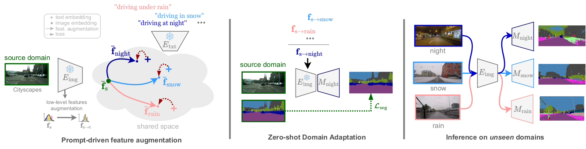
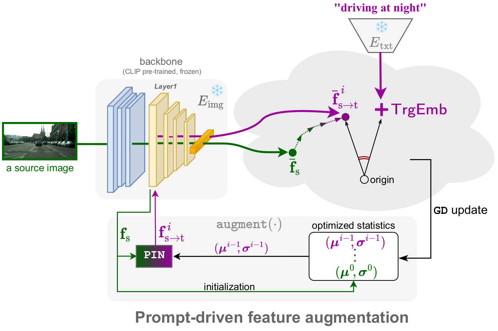
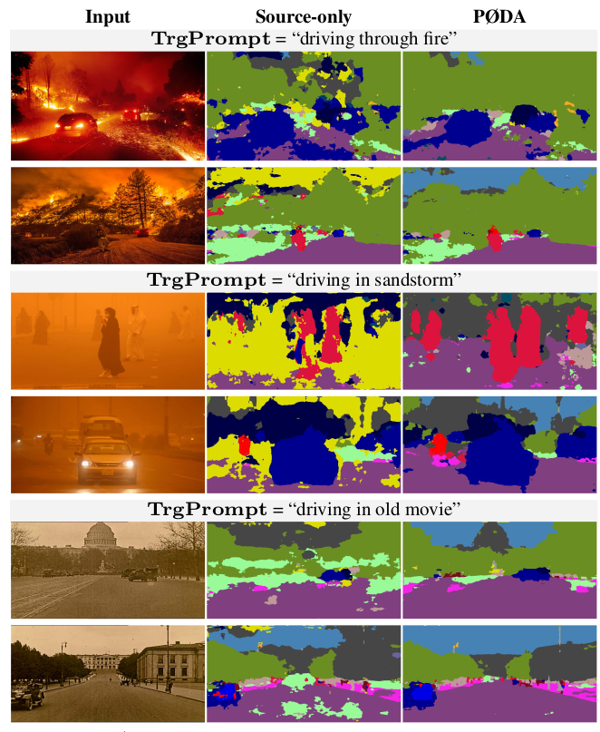
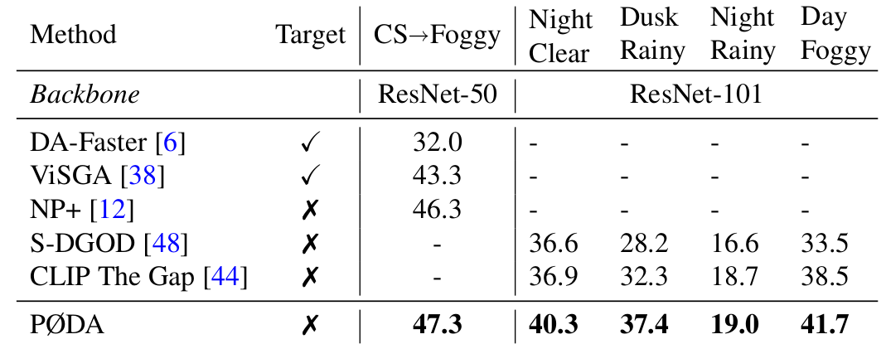

# PØDA: Prompt-driven Zero-shot Domain Adaptation
[Mohammad Fahes<sup>1</sup>](https://mfahes.github.io/),
[Tuan-Hung Vu<sup>1,2</sup>](https://tuanhungvu.github.io/),
[Andrei Bursuc<sup>1,2</sup>](https://abursuc.github.io/),
[Patrick Pérez<sup>1,2</sup>](https://ptrckprz.github.io/),
[Raoul de Charette<sup>1</sup>](https://team.inria.fr/rits/membres/raoul-de-charette/)</br>
<sup>1</sup> Inria, Paris, France.

<sup>2</sup> valeo.ai, Paris, France.<br>

TL; DR: PØDA (or PODA) is a simple feature augmentation method for zero-shot domain adaptation guided by a single textual description of the target domain.

Project page: https://astra-vision.github.io/PODA/  
Paper: https://arxiv.org/abs/2212.03241

## Citation
```
@article{fahes2022poda,
  title={P{\O}DA: Prompt-driven Zero-shot Domain Adaptation},
  author={Fahes, Mohammad and Vu, Tuan-Hung and Bursuc, Andrei and P{\'e}rez, Patrick and de Charette, Raoul},
  journal={arXiv preprint arXiv:2212.03241},
  year={2022}
}
```
# Overview
<p align="center">
  <b>Overview of PØDA</b>
</p>
<p align="center">
  
</p>

# Method
<p align="center">
  <b>Optimizing AdaIN layer based on "feature/target domain description" similarity</b>
</p>
<p align="center">
  
</p>

# Teaser
<p align="center">
  <b>Test on unseen youtube video of night driving:<br />
  Training dataset: Cityscapes <br />
  Prompt: "driving at night"
  </b>
</p>
<p align="center">
  
</p>

# Table of Content
- [Installation](#installation)
  - [Dependencies](#dependencies)
  - [Datasets](#datasets)
  - [Pretrained models](#pretrained-models)
- [Running PØDA](#running-poda)
  - [Source training](#source-training)
  - [Feature optimization](#feature-optimization)
  - [Model adaptation](#model-adaptation)
  - [Evaluation](#evaluation)
- [Inference & Visualization](#inference--visualization)
- [Qualitative Results](#qualitative-results)
- [PØDA for Object Detection](#pØda-for-object-detection)
- [License](#license)
- [Acknowledgement](#acknowledgement)

# Installation
## Dependencies

First create a new conda environment with the required packages:
```
conda env create --file environment.yml
```

Then activate environment using:
```
conda activate poda_env
```

## Datasets

* **CITYSCAPES**: Follow the instructions in [Cityscapes](https://www.cityscapes-dataset.com/)
  to download the images and semantic segmentation ground-truths. Please follow the dataset directory structure:
  ```html
  <CITYSCAPES_DIR>/             % Cityscapes dataset root
  ├── leftImg8bit/              % input image (leftImg8bit_trainvaltest.zip)
  └── gtFine/                   % semantic segmentation labels (gtFine_trainvaltest.zip)
  ```

* **ACDC**: Download ACDC images and ground truths from [ACDC](https://acdc.vision.ee.ethz.ch/download). Please follow the dataset directory structure:
  ```html
  <ACDC_DIR>/                   % ACDC dataset root
  ├── rbg_anon/                 % input image (rgb_anon_trainvaltest.zip)
  └── gt/                       % semantic segmentation labels (gt_trainval.zip)
  ```
 
* **GTA5**: Download GTA5 images and ground truths from [GTA5](https://download.visinf.tu-darmstadt.de/data/from_games/). Please follow the dataset directory structure:
  ```html
  <GTA5_DIR>/                   % GTA5 dataset root
  ├── images/                   % input image 
  └── labels/                   % semantic segmentation labels
  ```

## Pretrained models
The source-only pretrained models are available [here](https://drive.google.com/drive/folders/15-NhVItiVbplg_If3HJibokJssu1NoxL?usp=share_link)

# Running PØDA

## Source training
```
python3 main.py \
  --dataset <source_dataset> \
  --data_root <path_to_source_dataset> \
  --data_aug \
  --lr 0.1 \
  --crop_size 768 \
  --batch_size 2 \
  --freeze_BB \
  --ckpts_path saved_ckpts
```

## Feature optimization
```
python3 f_aug_with_CLIP.py \
--dataset <source_dataset> \
--data_root <path_to_source_dataset> \
--total_it 100 \
--resize_feat \
--domain_desc <target_domain_description>  \
--save_dir <directory_for_saved_statistics>
```

## Model adaptation
``` 
python3 main.py \
--dataset <source_dataset> \
--data_root <path_to_source_dataset> \
--ckpt <path_to_source_checkpoint> \
--batch_size 16 \
--lr 0.001 \
--ckpts_path adapted \
--freeze_BB \
--train_aug \
--total_itrs 2000 \ 
--path_mu_sig <path_to_augmented_statistics>
```

## Evaluation
```
python3 main.py \
--dataset <dataset_name> \
--data_root <dataset_path> \
--ckpt <path_to_tested_model> \
--test_only \
--val_batch_size 1 \
--ACDC_sub <ACDC_subset_if_tested_on_ACDC>   
```

# Inference & Visualization
To test any model on any image and visualize the output, please add the images to predict_test directory and run:
``` 
python3 predict.py \
--ckpt <ckpt_path> \
--save_val_results_to <directory_for_saved_output_images>
```

# Qualitative Results
<p align="center">
  <b>PØDA for uncommon driving situations</b>
</p>
<p align="center">
  
</p>

# PØDA for Object Detection
Our feature augmentation is task-agnostic, as it operates on the feature extractor's level. We show some preliminary results of PØDA for object detection. The metric is mAP%
<p align="center">
  
</p>

# License
PØDA is released under the [Apache 2.0 license](./LICENSE).

# Acknowledgement
The code is based on this implementation of [DeepLabv3+](https://github.com/VainF/DeepLabV3Plus-Pytorch), and uses code from [CLIP](https://github.com/mfahes/CLIP)

---

[↑ back to top](#pØda-prompt-driven-zero-shot-domain-adaptation)
